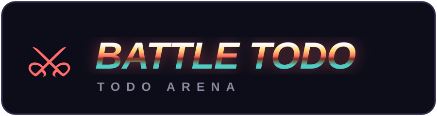
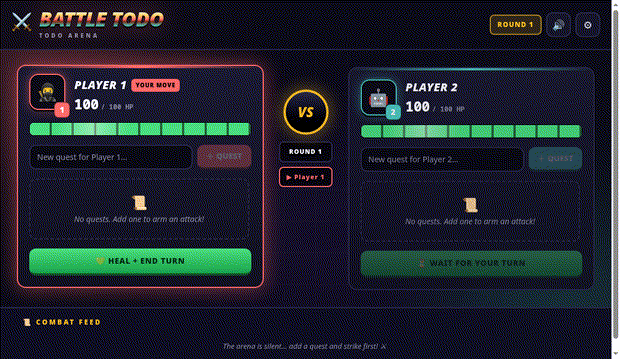
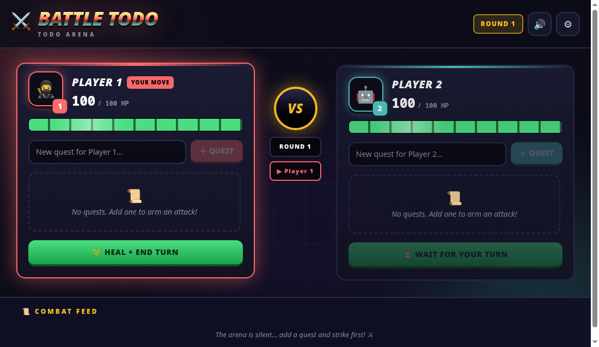
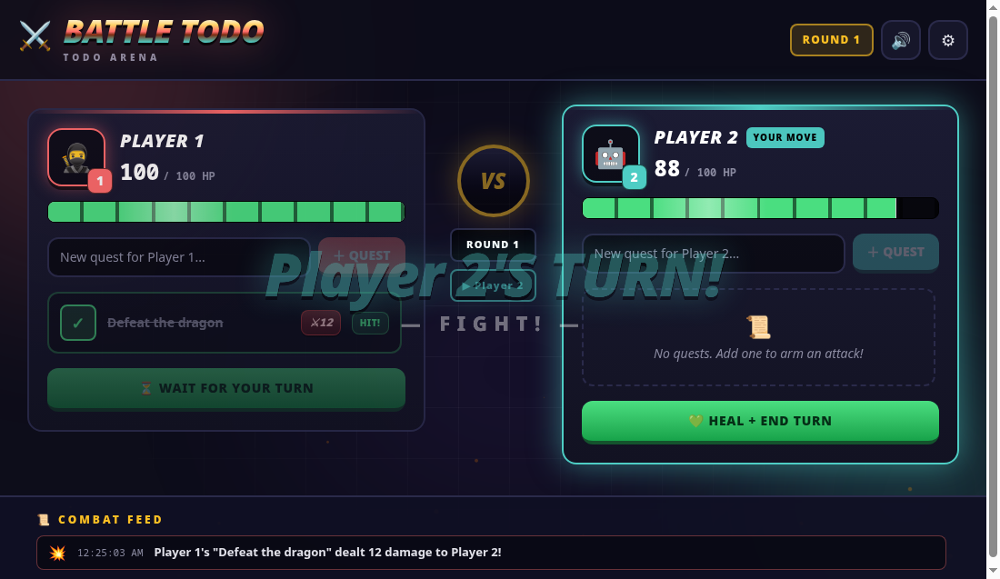

<p align="center">
  
</p>

<p align="center">
  <strong>A 2-player battle todo list game.</strong> Add quests, strike them to deal damage, and knock out your opponent.
</p>

<p align="center">
  
</p>

## How it plays

| | |
|---|---|
| 📜 **Add a quest** | Type a task and press Enter (or ＋ QUEST). Each quest rolls 10–20 attack power. |
| ⚔️ **Strike** | Hit the strike button on your turn — the quest slams the opponent for its damage. Crits (19+) go big and gold. |
| 💚 **Heal** | Only with zero pending quests (no heal-stalling). Restores 10–25 HP and ends your turn. |
| 🏆 **Win** | First fighter to drop the other to 0 HP takes the arena. Rematch below the confetti. |

Turns alternate automatically after every strike or heal. Only the active fighter's buttons are armed.

## Screenshots

<p align="center">
  
</p>

*The arena: ghost-drain HP bars, YOUR MOVE tags, VS medallion, round tracker, combat feed.*

<p align="center">
  
</p>

*A strike landing: 12 damage, HP bar draining, HIT stamp, combat-feed entry, turn banner.*

## Run it

Requires [Bun](https://bun.sh) 1.4+.

```bash
bun install
bun run dev      # local arena at http://localhost:5173
bun run typecheck
bun run build
bun run preview
```

| Script | What it does |
|---|---|
| `bun run dev` | Vite dev server with HMR |
| `bun run typecheck` | `tsc --noEmit` — must pass |
| `bun run build` | Production build to `dist/` |
| `bun run preview` | Serve the production build |
| `bun x biome check` | Lint + format check (also runs on pre-commit) |
| `bun x biome format --write` | Auto-format |

## Tech

- **React 19 + TypeScript + Vite**, state in a `useGame()` hook (`src/hooks/useGame.ts`)
- **TailwindCSS v4** (`@tailwindcss/vite`) + hand-rolled keyframes in `src/index.css`
- **WebAudio synth SFX** — hit, crit, heal, turn jingle, victory fanfare, zero audio files (`src/utils/sound.ts`, 🔊 toggle persisted)
- **Biome** for lint/format, **Husky + commitlint** for conventional commits
- Progress auto-saves to `localStorage`

```
src/
├── App.tsx               # Arena: header, turn banner, VS column, victory, combat feed
├── components/           # BattleSide (fighter card), TaskItem (quest card), Floater (damage numbers)
├── hooks/useGame.ts      # All game state and rules
├── utils/                # helpers, constants, sound
├── types.ts              # Shared TypeScript interfaces
└── index.css             # Theme vars, keyframes, floater/fx classes
```

See [AGENTS.md](AGENTS.md) for architecture notes, gotchas, and conventions.
